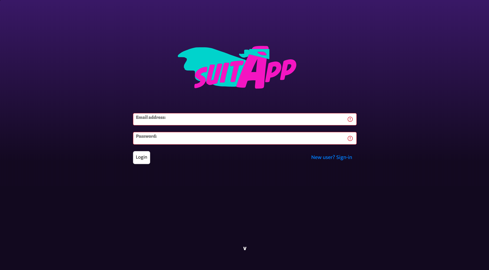

# SuitApp (a full-stack web app)

### NOTE: this project is forked from our [group project](https://github.com/AminesCodes/React-Group-Project_Social-Media) then user authentication, cloud storage and setting for deployment where added

*SuitApp is a social media site founded on the idea of bringing together the most passionate and creative minds in the world of Cosplay and giving them the tools to reach a wide audience of fans who appreciate and celebrate their work.*

## Developers
+ [Amine Bensalem](https://github.com/AminesCodes)
+ [Douglas MacKrell](https://github.com/DouglasMacKrell)
+ [Joseph P. Pasaoa](https://github.com/joseph-p-pasaoa)

## Contributor
+ [Savita Madray](https://github.com/SavitaMadray)

### Roles
+ Tech Lead, Project Manager, Head of UI/UX, PR Review Chief

### Tech
+ PostgreSQL
+ Express.js
+ React.js
+ Node.js
+ JavaScript / ECMAScript 6
+ HTML5
+ CSS3
+ Bootstrap CSS
+ Pg-Promise
+ Axios
+ Toastify
+ Git / Github
+ Trello